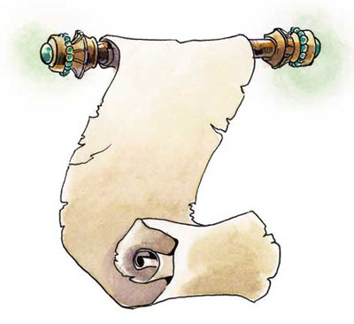

# Oghma 

Oghma is a command-line tool for scraping a citation graph from [google-scholar](https://scholar.google.com/) starting from some seminal works.
[google-scholar](https://scholar.google.com/) will prompt a captcha from time to time even though Oghma uses Selenium and only launches requests every 5 to 10 seconds.
In which case a notification will pop-up; once you resolved the capcha, you can press `<enter>` in the terminal to resume the scraping.
Using a Firefox profile can help to remain undercover; being logged in a [gmail](https://mail.google.com) account in this profile is even better.
To install Oghma run:

```
npm install oghma
```

Oghma understand the following arguments:
  1. `--nodes`: path to a file containing the nodes of the citations graph, each line is a json string encoding the node.
  2. `--edges`: path to a file containing the edges of the citations graph, each line is an array of integer which indicates the line number of the citers of the node at the current line number.
  3. `[--delay 5000]`: the number of millisecond between request is: `delay * (1 + Math.random())`
  4. `[--limit 1000]`: the maximum number of citers a single paper can have.
     There is no use to increase this parameter beyond 1000 since google only provide the 1000th first hits.
  5. `[--cite 0]`: minimum number of citations required to enter the citation graph.
  6. `[--profile]`: path to a firefox-profile

Every time you invoke `oghma` it will explore the last breadth of the citation graph.
Breadth of the citation graph are separated with a line containing `null` in the node file and the edge file.
Example of run:

```
laurent$ oghma --nodes nodes.json --edges edges.json
Enter an EXACT influencal paper's title [empty line to stop]...
Prevalence and maintenance of automated functional tests for web applications
Get https://scholar.google.com/scholar?as_vis=1&q=allintitle:+%22Prevalence+and+maintenance+of+automated+functional+tests+for+web+applications%22&hl=en&as_sdt=1,5
Prevalence and maintenance of automated functional tests for web applications added at line 0
Enter an EXACT influencal paper's title [empty line to stop]...

laurent$ oghma --nodes nodes.json --edges edges.json
Get https://scholar.google.com/scholar?cites=16745770698039951734&as_sdt=2005&sciodt=1,5&hl=en
The current breadth is completely explored.
$ oghma --nodes nodes.json --edges edges.json
Get https://scholar.google.com/scholar?cites=5023972618871090724&as_sdt=2005&sciodt=1,5&hl=en
Get https://scholar.google.com/scholar?cites=15052621572740748236&as_sdt=2005&sciodt=1,5&hl=en
Get https://scholar.google.com/scholar?cites=7886313667668877700&as_sdt=2005&sciodt=1,5&hl=en
Get https://scholar.google.com/scholar?cites=8366179782255963310&as_sdt=2005&sciodt=1,5&hl=en
Get https://scholar.google.com/scholar?cites=789763819739665850&as_sdt=2005&sciodt=1,5&hl=en
The current breadth is completely explored.
...
laurent$ oghma --nodes nodes.json --edges edges.json
Oghma reached a fixpoint, the citation graph is complete!
```

Content of `nodes.json`:

```js
{"cite":{"count":9,"url":"https://scholar.google.com/scholar?cites=16745770698039951734&as_sdt=2005&sciodt=1,5&hl=en"},"title":"Prevalence and maintenance of automated functional tests for web applications","authors":["L Christophe","R Stevens","C De Roover…"],"venue":"… (ICSME), 2014 IEEE …","year":2014,"publisher":"ieeexplore.ieee.org"}
null
{"cite":{"count":4,"url":"https://scholar.google.com/scholar?cites=5023972618871090724&as_sdt=2005&sciodt=1,5&hl=en"},"title":"Automated generation of visual web tests from DOM-based web tests","authors":["M Leotta","A Stocco","F Ricca","P Tonella"],"venue":"Proceedings of the 30th Annual …","year":2015,"publisher":"dl.acm.org","pdf":"http://www.academia.edu/download/42891632/Automated_Generation_of_Visual_Web_Tests20160220-11512-1l7biz6.pdf"}
{"cite":{"count":6,"url":"https://scholar.google.com/scholar?cites=15052621572740748236&as_sdt=2005&sciodt=1,5&hl=en"},"title":"ROBULA+: an algorithm for generating robust XPath locators for web testing","authors":["M Leotta","A Stocco","F Ricca…"],"venue":"Journal of Software: …","year":2016,"publisher":"Wiley Online Library"}
{"cite":{"count":1,"url":"https://scholar.google.com/scholar?cites=7886313667668877700&as_sdt=2005&sciodt=1,5&hl=en"},"title":"Fine-tuning spectrum based fault localisation with frequent method item sets","authors":["G Laghari","A Murgia","S Demeyer"],"venue":"Proceedings of the 31st IEEE/ACM …","year":2016,"publisher":"dl.acm.org","pdf":"https://www.researchgate.net/profile/Gulsher_Laghari/publication/306394778_Fine-Tuning_Spectrum_Based_Fault_Localisation_with_Frequent_Method_Item_Sets/links/57bc80f408ae3fbb8643ff77.pdf"}
{"cite":{"count":2,"url":"https://scholar.google.com/scholar?cites=8366179782255963310&as_sdt=2005&sciodt=1,5&hl=en"},"title":"Querying the History of Software Projects Using QWALKEKO.","authors":["R Stevens","C De Roover"],"venue":"ICSME","year":2014,"publisher":"conferences.computer.org","pdf":"ftp://prog.vub.ac.be/tech_report/2014/vub-soft-tr-14-13.pdf"}
{"cite":{"count":0},"title":"Chapter Four-Advances in Web Application Testing, 2010–2014","authors":["S Sampath","S Sprenkle"],"venue":"Advances in Computers","year":2016,"publisher":"Elsevier"}
{"cite":{"count":0},"title":"APOGEN: automatic page object generator for web testing","authors":["A Stocco","M Leotta","F Ricca","P Tonella"],"venue":"Software Quality Journal","year":2016,"publisher":"Springer"}
{"cite":{"count":1,"url":"https://scholar.google.com/scholar?cites=789763819739665850&as_sdt=2005&sciodt=1,5&hl=en"},"title":"A declarative foundation for comprehensive history querying","authors":["R Stevens"],"venue":"2015 IEEE/ACM 37th IEEE International …","year":2015,"publisher":"ieeexplore.ieee.org","pdf":"ftp://mail.ssel.vub.ac.be/tech_report/2015/vub-soft-tr-15-05.pdf"}
{"cite":{"count":0},"title":"Extracting Executable Transformations from Distilled Code Changes","authors":["R Stevens","C De Roover"],"venue":"Changes","publisher":"soft.vub.ac.be","pdf":"http://soft.vub.ac.be/Publications/2017/vub-soft-tr-17-01.pdf"}
{"cite":{"count":0},"title":"AspectJ code analysis and verification with GASR","authors":["J Fabry","C De Roover","C Noguera","S Zschaler…"],"venue":"Journal of Systems and …","year":2016,"publisher":"Elsevier"}
null
{"cite":{"count":14,"url":"https://scholar.google.com/scholar?cites=6349414177692012259&as_sdt=2005&sciodt=1,5&hl=en"},"title":"Using multi-locators to increase the robustness of web test cases","authors":["M Leotta","A Stocco","F Ricca…"],"venue":"2015 IEEE 8th …","year":2015,"publisher":"ieeexplore.ieee.org","pdf":"http://sepl.dibris.unige.it/publications/2015-leotta-ICST.pdf"}
{"cite":{"count":6,"url":"https://scholar.google.com/scholar?cites=3612787553443377440&as_sdt=2005&sciodt=1,5&hl=en"},"title":"Chapter Five-Approaches and Tools for Automated End-to-End Web Testing","authors":["M Leotta","D Clerissi","F Ricca","P Tonella"],"venue":"Advances in Computers","year":2016,"publisher":"Elsevier"}
{"cite":{"count":1,"url":"https://scholar.google.com/scholar?cites=13037897773368252272&as_sdt=2005&sciodt=1,5&hl=en"},"title":"Clustering-Aided Page Object Generation for Web Testing","authors":["A Stocco","M Leotta","F Ricca","P Tonella"],"venue":"International Conference on Web …","year":2016,"publisher":"Springer","pdf":"http://sepl.dibris.unige.it/publications/2016-stocco-ICWE-full.pdf"}
{"cite":{"count":2,"url":"https://scholar.google.com/scholar?cites=6394621670766304520&as_sdt=2005&sciodt=1,5&hl=en"},"title":"Waterfall: An incremental approach for repairing record-replay tests of web applications","authors":["M Hammoudi","G Rothermel","A Stocco"],"venue":"… of the 2016 24th ACM SIGSOFT …","year":2016,"publisher":"dl.acm.org","pdf":"https://www.researchgate.net/profile/Andrea_Stocco2/publication/308161248_WATERFALL_An_Incremental_Approach_for_Repairing_Record-Replay_Tests_of_Web_Applications/links/57db9a8208aeea195932c7ef.pdf"}
{"cite":{"count":0},"title":"A Lightweight Semi-automated Acceptance Test-Driven Development Approach for Web Applications","authors":["D Clerissi","M Leotta","G Reggio","F Ricca"],"venue":"International Conference on Web …","year":2016,"publisher":"Springer","pdf":"http://sepl.dibris.unige.it/publications/2016-clerissi-ICWE.pdf"}
{"cite":{"count":0},"title":"Automatic Page Object Generation with APOGEN","authors":["A Stocco","M Leotta","F Ricca","P Tonella"],"venue":"International Conference on Web …","year":2016,"publisher":"Springer","pdf":"http://sepl.dibris.unige.it/publications/2016-stocco-ICWE-demo.pdf"}
{"cite":{"count":0},"title":"Regression testing of web applications using Record/Replay tools","authors":["M Hammoudi"],"venue":"Proceedings of the 2016 24th ACM SIGSOFT …","year":2016,"publisher":"dl.acm.org","pdf":"http://cse.unl.edu/~mouna/WebApps/DOCTO.pdf"}
{"cite":{"count":0},"title":"Improved bug localization based on code change histories and bug reports","authors":["KC Youm","J Ahn","E Lee"],"venue":"Information and Software Technology","year":2017,"publisher":"Elsevier"}
null
{"cite":{"count":10,"url":"https://scholar.google.com/scholar?cites=6385929497742039570&as_sdt=2005&sciodt=1,5&hl=en"},"title":"Why creating web page objects manually if it can be done automatically?","authors":["A Stocco","M Leotta","F Ricca…"],"venue":"Automation of Software …","year":2015,"publisher":"ieeexplore.ieee.org"}
{"cite":{"count":2,"url":"https://scholar.google.com/scholar?cites=16721242835796939196&as_sdt=2005&sciodt=1,5&hl=en"},"title":"Meta-heuristic generation of robust XPath locators for web testing","authors":["M Leotta","A Stocco","F Ricca","P Tonella"],"venue":"Proceedings of the Eighth …","year":2015,"publisher":"dl.acm.org"}
{"cite":{"count":4,"url":"https://scholar.google.com/scholar?cites=6820762479061415717&as_sdt=2005&sciodt=1,5&hl=en"},"title":"Synthesizing Web Element Locators (T)","authors":["K Bajaj","K Pattabiraman…"],"venue":"… Software Engineering (ASE …","year":2015,"publisher":"ieeexplore.ieee.org","pdf":"http://salt.ece.ubc.ca/publications/docs/ase15-led.pdf"}
{"cite":{"count":0},"title":"for Web Testing","authors":["M Leotta","A Stocco","F Ricca","P Tonella"],"venue":"2015","publisher":"pdfs.semanticscholar.org","pdf":"https://pdfs.semanticscholar.org/822e/b845f2bdcf7b3de2d92049aaf0f65a5823f7.pdf"}
{"cite":{"count":0},"title":"Be Done Automatically?","authors":["A Stocco","M Leotta","F Ricca","P Tonella"],"venue":"2015","publisher":"sepl.dibris.unige.it","pdf":"http://sepl.dibris.unige.it/publications/2015-stocco-AST.pdf"}
{"cite":{"count":3,"url":"https://scholar.google.com/scholar?cites=11670798466214042679&as_sdt=2005&sciodt=1,5&hl=en"},"title":"Why Do Record/Replay Tests of Web Applications Break?","authors":["M Hammoudi"],"venue":"2016","publisher":"digitalcommons.unl.edu"}
{"cite":{"count":0},"title":"Benchmarking Web-testing-Selenium versus Watir and the Choice of Programming Language and Browser","authors":["M Kuutila","M Mäntylä","P Raulamo-Jurvanen"],"venue":"arXiv preprint arXiv: …","year":2016,"publisher":"arxiv.org"}
null
{"cite":{"count":3,"url":"https://scholar.google.com/scholar?cites=13576150409872254886&as_sdt=2005&sciodt=1,5&hl=en"},"title":"Clustering-Aided Page Object Generation for Web Testing","authors":["A Stocco","M Leotta","F Ricca","P Tonella"],"publisher":"researchgate.net","pdf":"https://www.researchgate.net/profile/Andrea_Stocco2/publication/296520249_Clustering-Aided_Page_Object_Generation_for_Web_Testing/links/5745796008ae298602f772fe.pdf"}
{"cite":{"count":3,"url":"https://scholar.google.com/scholar?cites=4706726280710384039&as_sdt=2005&sciodt=1,5&hl=en"},"title":"Incremental Web Application Testing using Page Object","authors":["B Yu","L Ma","C Zhang"],"venue":"Hot Topics in Web Systems and …","year":2015,"publisher":"ieeexplore.ieee.org"}
{"cite":{"count":2,"url":"https://scholar.google.com/scholar?cites=18235421153073739747&as_sdt=2005&sciodt=1,5&hl=en"},"title":"Software Analysis for the Web: Achievements and Prospects","authors":["A Mesbah"],"venue":"2016 IEEE 23rd International Conference on …","year":2016,"publisher":"ieeexplore.ieee.org","pdf":"http://salt.ece.ubc.ca/publications/docs/fose16.pdf"}
{"cite":{"count":2,"url":"https://scholar.google.com/scholar?cites=12901112158396105192&as_sdt=2005&sciodt=1,5&hl=en"},"title":"LED: Tool for Synthesizing Web Element Locators","authors":["K Bajaj","K Pattabiraman…"],"venue":"… Software Engineering (ASE …","year":2015,"publisher":"ieeexplore.ieee.org"}
null
{"cite":{"count":1,"url":"https://scholar.google.com/scholar?cites=15097580583228323192&as_sdt=2005&sciodt=1,5&hl=en"},"title":"Retrofitting automatic testing through library tests reusing","authors":["L Ma","C Zhang","B Yu","J Zhao"],"venue":"Program Comprehension (ICPC) …","year":2016,"publisher":"ieeexplore.ieee.org","pdf":"http://cse.sjtu.edu.cn/~zhao/pub/pdf/icpc2016b.pdf"}
{"cite":{"count":0},"title":"An empirical study on the effects of code visibility on program testability","authors":["L Ma","C Zhang","B Yu","H Sato"],"venue":"Software Quality Journal","year":2016,"publisher":"Springer"}
{"cite":{"count":0},"title":"Instatiating the page object pattern in desktop applications","authors":["CDEC DA COMPUTAÇÃO"],"venue":"2016","publisher":"lume.ufrgs.br"}
{"cite":{"count":0},"title":"D-ForenRIA: A Distributed Tool to Reconstruct User Sessions for Rich Internet Applications","authors":["S Hooshmand","M Faheem","GV Bochmann","GV Jourdan…"],"venue":"2016","publisher":"ssrg.site.uottawa.ca","pdf":"http://ssrg.site.uottawa.ca/docs/D-ForenRIA_cascon.pdf"}
{"cite":{"count":0},"title":"Detecting Function Constructors in JavaScript","authors":["S Rostami","L Eshkevari","D Mazinanian","N Tsantalis"],"publisher":"users.encs.concordia.ca","pdf":"http://users.encs.concordia.ca/~nikolaos/publications/ICSME_2016.pdf"}
null
```

Content of `edges.json`:

```js
[2,3,4,5,6,7,8,9,10]
null
[12,13,3,14]
[15,14,16,17,7,18]
[19]
[8,9]
[]
[]
[9]
[]
[]
null
[21,13,3,22,23,15,14,24,25,17,7,18,26]
[3,14,16,27,17,7]
[17]
[7,18]
[]
[]
[]
[]
null
[13,15,14,29,30,17,7,18,26]
[3,14]
[15,31,32,18]
[]
[]
[15,7,18]
[]
null
[15,7,18]
[34,35,36]
[37,38]
[15,18]
null
[35]
[]
[]
[]
[]
null
```
